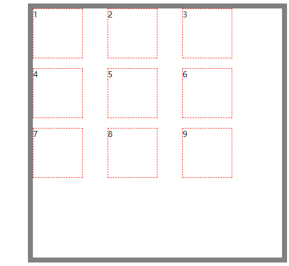
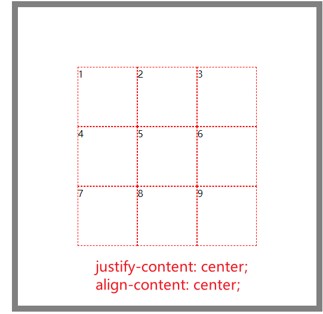
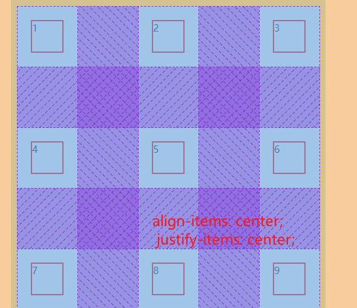
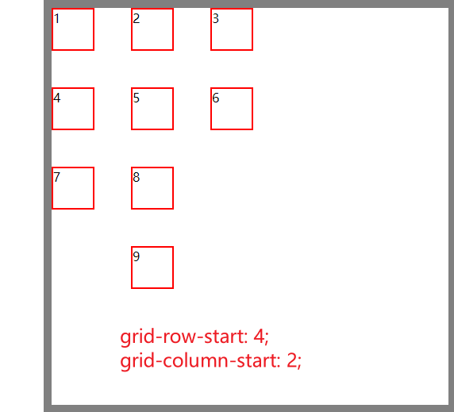

# css grid 布局学习

## 1.概念

grid 网格布局,是一种新的 css 布局方式, 它将网页划分成一个个网格,可以任意组合, 而且支持响应式布局

grid 布局和 flex 布局其实很相似, 都可以实现水平, 垂直, 网格布局, 只不过 flex 布局是轴向布局, 只能从左到右, 从上到下, 而 grid 布局是平面布局, 可以任意组合

## 2.容器属性

### 开启 gird 布局

```css
.container {
  display: grid;
}
```

### 容器划分 colums 和 row

1. 取值为数值 grid-template-rows:100px 100px 100px
2. 取值为百分比 grid-template-rows:20% 30% 50%
3. 重复函数 grid-template-rows:repeat(3,20%)
4. 自动填充 grid-template-rows:repeat(auto-fill, 30%)
5. auto 自动 grid-template-rows:100px auto 100px
6. fr 片段划分 grid-template-rows:1fr 2fr 1fr
7. minmax() grid-template-rows:200px 200px minmax(100px,200px)

### 列间距和行间距

```css
.container {
  grid-row-gap: 20px;
  grid-column-gap: 50px;
}

/** 复合写法 */
.container {
  grid-gap: 20px 50px;
}
```



### 容器内网格对其方式

```css
.container {
  justify-content: start | end | center | stretch | space-around | space-between
    | space-evenly;
  align-content: start | end | center | stretch | space-around | space-between;
}
```



### 容器内网格内子元素对其方式

```css
.container {
  align-items: start | end | center | stretch | baseline | auto;
  justify-items: start | end | center | stretch | auto;
}
```

### 网格元素排列顺序

```css
.container {
  grid-auto-flow: row | column | row dense | column dense;
}
```



### 指定元素在特定的位置

```css
.container {
  grid-row-start: 4;
  grid-column-start: 2;
}
```



### 网格指定区域(合并单元格)

```html
<style>
  .box {
    display: grid;
    width: 500px;
    height: 500px;
    border: 10px solid gray;
    margin: 0 auto;
    display: grid;
    grid-template-columns: 1fr 1fr 1fr;
    grid-template-rows: 1fr 1fr 1fr;
    grid-template-areas:
      "a a c"
      "a a c"
      "b b c";
  }
  .a {
    grid-area: a;
    background-color: red;
  }

  .b {
    grid-area: b;
    background-color: rgb(15, 1, 1);
  }

  .c {
    grid-area: c;
    background-color: rgb(9, 129, 79);
  }
</style>
<div class="box">
  <div class="a">1</div>
  <div class="a">2</div>
  <div class="c">3</div>
  <div class="a">4</div>
  <div class="a">5</div>
  <div class="c">6</div>
  <div class="b">7</div>
  <div class="b">8</div>
  <div class="c">9</div>
</div>
```

### 合并单元格

```css
...container {
  /* 写法一：*/
  grid-column-start: 1;
  grid-column-end: 3;

  /* 写法二：*/
  grid-column: 1 / 3;
  grid-row: 1 / 2;
}
```
